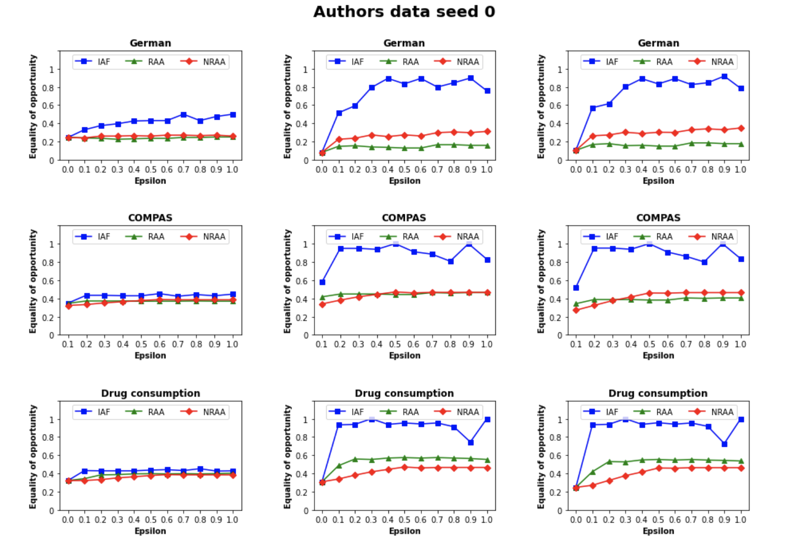

# Fairness, Accountability, Confidentiality and Transparency in AI
This repository contains code for the introduced attacks in [Exacerbating Algorithmic Bias through Fairness Attacks](https://arxiv.org/pdf/2012.08723.pdf).
Furthermore, some changes are made to evaluate whether the results/paper is reproducable.

# Exacerbating Algorithmic Bias through Fairness Attacks
```
@article{mehrabi2020exacerbating,
  title={Exacerbating Algorithmic Bias through Fairness Attacks},
  author={Mehrabi, Ninareh and Naveed, Muhammad and Morstatter, Fred and Galstyan, Aram},
  journal={arXiv preprint arXiv:2012.08723},
  year={2020}
}
```

Their code builds upon the code developed by different authors. Their LICENSE.md file is still included to give due credit to these researchers, and to document that their license allows us to build upon their work. If necessary, give them credit by citing, which you can find on the GitHub link of [Ninareh](https://github.com/Ninarehm/attack).

The citations of the datasets are as follows:
	For German and Drug consumption datasets cite:
 ```
@misc{Dua:2019 ,
author = "Dua, Dheeru and Graff, Casey",
year = "2017",
title = "{UCI} Machine Learning Repository",
url = "http://archive.ics.uci.edu/ml",
institution = "University of California, Irvine, School of Information and Computer Sciences" }
 ```
 For the COMPAS dataset cite: 	
 ```
@article{larson2016compas,
  title={Compas analysis},
  author={Larson, J and Mattu, S and Kirchner, L and Angwin, J},
  journal={GitHub, available at: https://github. com/propublica/compas-analysis[Google Scholar]},
  year={2016}
}
 ```

# Tested Environment
The code was tested in the environment provided by the authors. The following requirements would work:  
Python 3.6
PIP 20.3.1
setuptools 19.2 (in most of the cases you have to downgrade)
Tensorflow 1.12.3
scikit-learn 0.23.1  
tensorboard 1.12.2
cvxpy 0.4.11 [cvxpy 1.0+ is not backwards compatible, therefore the downgrade of setuptools]
CVXcanon 0.1.1  
scs 2.1.2
scipy 1.1.0  
numpy 1.16.2
pandas 1.1.4  
Matplotlib 3.3.3  
tabulate 0.8.9
seaborn 0.11.0  
tqdm 4.62.3
IPython 7.16.1
pillow 8.0.1


# Running Instructions
The dataset can be replaced by the dataset of your choice. To do this the right way:
- German: --dataset german --sensitive_attr_filename german_group_label.npz
- Compas: --dataset compas --sensitive_attr_filename compas_group_label.npz
- Drug: --dataset drug --sensitive_attr_filename drug2_group_label.npz

Same goes for the attacks:
- Influence attack on fairness (IAF): --method IAF
- Random anchoring attack (RAA): --method RAA
- Non-random anchoring attack (NRAA): --method NRAA  

To run the attacks (changes can be made accordingly to epsilon, sensitive_feature_idx, dataset etc.) as explained in the [paper](https://arxiv.org/pdf/2012.08723.pdf):
```bash
python run_gradient_em_attack.py --em_iter 0 --total_grad_iter 10000 --dataset german --use_slab --sensitive_feature_idx 36 --sensitive_attr_filename german_group_label.npz --method IAF --epsilon 0.1
```

# Our additions:
We have added two parameters:
- --recreated_data: which is by default no. This means that the model will run on the authors data. If yes or y is filled in, the model will make a similar datasets to that of the authors (same preprocessing techniques) and run these. Only the shuffling will be different. Please be aware that this should only be done once. Otherwise the results will not be comparable. 
- --rand_seed: which is by default 0. This one should be a natural value $(\mathbb{N})$, i.e. a non-negative integer. However, a value $\in$ {0,1,2,3} is recommended, since this value is added to the seeds already implemented by the authors.

We have added four folders in the main folder Fairness_attack:
- authors_data: which is the data provided by the authors.
- recreated_data: which consists of a resources folder that contains the original raw data. To try and reproduce the results of the authors, a file named make_datasets.py is automatically called if the datasets are not yet recreated and --recreated_data y is included in the run (otherwise it will skip creating new datasets). The process of reproducing the datasets, is covered in the next folder.
- reverse_engineering: which also consists of the data provided by the authors as well as the original raw data. The Datasets - reverse_engineering notebook is there to show our reverse_engineering process and how we managed to create the same datasets by performing different operations and transformations.
- results: which consists of a plot_results_all_metrics.ipynb and plot_results_best_metrics.ipynb file. The first is only there to show that different metrics (mean, max and last) have been evaluated to check which one is the most comparable to the results of the authors. The second notebook is there to plot the results with the best metrics (in our case last).

Furthermore, for convenience, we set the **position of the sensitive feature at the start of each recreated dataset, thus sensitive_feature_idx should always be 0**, if --recreated_data y.

To run IAF for the recreated german dataset (--recreated_data y and --sensitive_feature_idx 0):
```bash
python run_gradient_em_attack.py --em_iter 0 --total_grad_iter 10000 --dataset german --use_slab --sensitive_feature_idx 0 --sensitive_attr_filename german_group_label.npz --method IAF --epsilon 0.1 --recreated_data y
```


To run the same example above with a different seed (+1 on the seeds implemented by the authors):
```bash
python run_gradient_em_attack.py --em_iter 0 --total_grad_iter 10000 --dataset german --use_slab --sensitive_feature_idx 0 --sensitive_attr_filename german_group_label.npz --method IAF --epsilon 0.1 --recreated_data y --rand_seed 1
```

To plot the results after running all the attacks on all datasets with epsilons from 0.0 up to 1, a notebook called plot_results_best_metric is added. For seed 0 this will produce and automatically plot the following image (with the default seed) together with a dataframe which shows the time taken in seconds and the number of iterations for each attack. 

